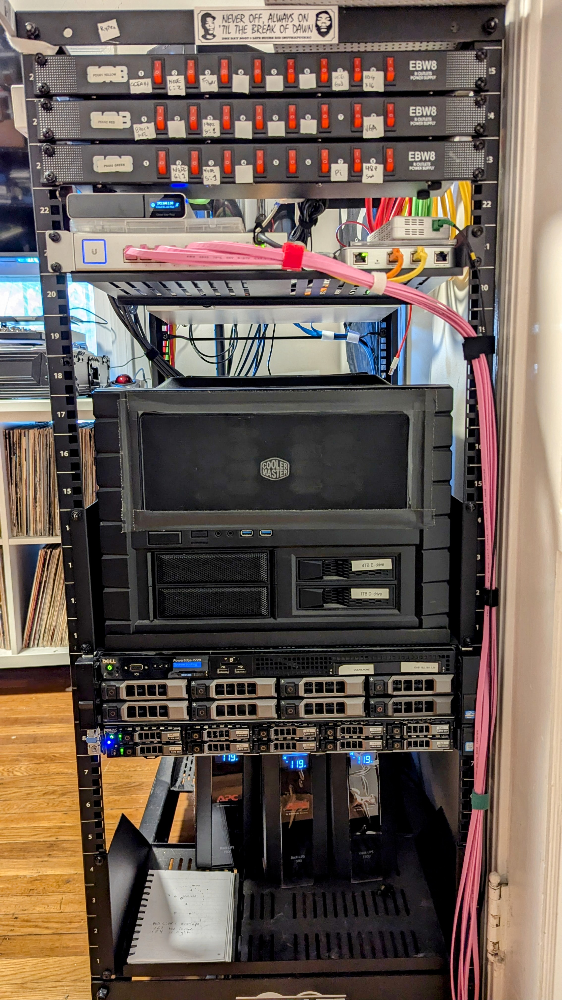
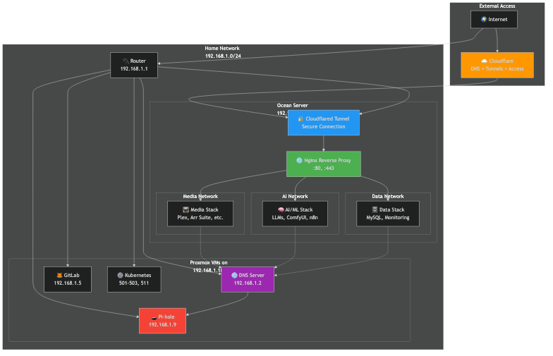
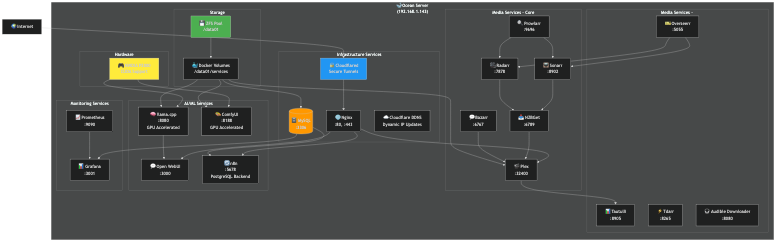
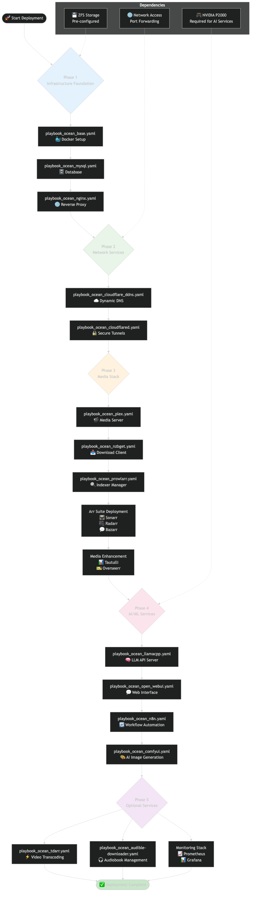

# Architecture Documentation

Architecture diagrams and documentation for the homelab infrastructure.

---

## Quick Reference

| Host | IP | Purpose |
|------|----|---------|
| node005 | 192.168.1.105 | Proxmox - Control VMs |
| node006 | 192.168.1.106 | Proxmox - Ocean VM |
| ocean | 192.168.1.143 | Docker services (VM on node006) |

---

## Documentation

| Document | Description |
|----------|-------------|
| [overview.md](overview.md) | System architecture overview |
| [networking.md](networking.md) | Network configuration |
| [network-topology.md](network-topology.md) | Network diagram |
| [ocean-services.md](ocean-services.md) | Ocean service architecture |
| [deployment-flow.md](deployment-flow.md) | Service deployment order |
| [physical-architecture.md](physical-architecture.md) | Physical server layout |

---

## Diagrams

### Physical Layout

### Network Topology

### Ocean Services

### Deployment Flow

---

## Infrastructure Summary

### Physical Servers

- **node005** (Dell R620): 56 cores, 128GB RAM - runs dns01, pihole, gitlab, gh-runner-01
- **node006** (Dell R720): 40 cores, 680GB RAM, RTX 3090 - runs ocean VM

### Ocean VM

- 30 cores, 256GB RAM
- ZFS storage (data01 - 8x 12TB raidz2)
- RTX 3090 GPU passthrough
- Docker services via systemd

### Services

- **Network**: nginx, cloudflared, cloudflare_ddns
- **AI/ML**: llama.cpp, Open WebUI, ComfyUI
- **Media**: Plex, Sonarr, Radarr, Prowlarr, Bazarr, NZBGet, Overseerr, Tautulli, Tdarr
- **Monitoring**: Prometheus, Grafana, NVIDIA DCGM, UnPoller
- **Services**: NextCloud, TinaCMS, Frigate, Home Assistant

---

## Related Documentation

- [Getting Started](../setup/getting-started.md)
- [Playbooks README](/playbooks/README.md)
- [DEVELOPMENT.md](/DEVELOPMENT.md)
