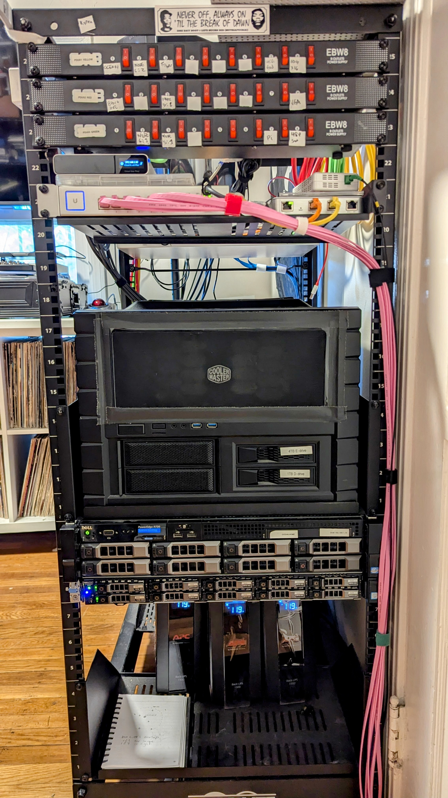

# Architecture Documentation

Architecture diagrams and documentation for the homelab infrastructure.

---

## Quick Reference

| Host | IP | Purpose |
|------|----|---------|
| node005 | 192.0.2.105 | Proxmox - Control VMs |
| node006 | 192.0.2.106 | Proxmox - Ocean VM |
| ocean | 192.0.2.143 | Docker services (VM on node006) |

---

## Documentation

| Document | Description |
|----------|-------------|
| [overview.md](overview.md) | System architecture overview |
| [networking.md](networking.md) | Network configuration |
| [network-topology.md](network-topology.md) | Network diagram |
| [ocean-services.md](ocean-services.md) | Ocean service architecture |
| [deployment-flow.md](deployment-flow.md) | Service deployment order |
| [physical-architecture.md](physical-architecture.md) | Physical server layout |

---

## Diagrams

### Physical Layout

### Network Topology

See [`network-topology.md`](./network-topology.md). The diagrams live as mermaid
in those documents rather than as exported images, because GitHub renders
mermaid natively and an exported PNG silently keeps whatever was true the day it
was rendered. The previous exports still showed real addresses long after the
source had been genericised, which is exactly the failure mode.

### Ocean Services

See [`ocean-services.md`](./ocean-services.md).

### Deployment Flow

See [`deployment-flow.md`](./deployment-flow.md).

---

## Infrastructure Summary

### Physical Servers

- **node005** (Dell R620): 56 cores, 128GB RAM - runs dns01, pihole, gitlab, gh-runner-01
- **node006** (Dell R720): 40 cores, 680GB RAM, RTX 3090 - runs ocean VM

### Ocean VM

- 30 cores, 256GB RAM
- ZFS storage (data01 - 8x 12TB raidz2)
- RTX 3090 GPU passthrough
- Docker services via systemd

### Services

- **Network**: nginx, cloudflared, cloudflare_ddns
- **AI/ML**: llama.cpp, Open WebUI, paia, mem0
- **Media**: Plex, Sonarr, Radarr, Prowlarr, Bazarr, NZBGet, Overseerr, Tautulli, Tdarr
- **Monitoring**: Prometheus, Grafana, NVIDIA DCGM, UnPoller
- **Services**: Home Assistant, GlobalView, WordPress

---

## Related Documentation

- [Getting Started](../setup/getting-started.md)
- [Playbooks README](/playbooks/README.md)
- [DEVELOPMENT.md](/DEVELOPMENT.md)
