# Deployment Flow

Ocean services deployment order based on `playbooks/03_ocean_services.yaml`.

---

## Master Playbook

```bash
ansible-playbook -i inventories/production/hosts.ini \
  playbooks/03_ocean_services.yaml --ask-vault-pass
```

---

## Deployment Phases

```mermaid
flowchart TD
    Start([Start]) --> Network{Network Services}
    
    Network --> DDNS[cloudflare_ddns.yaml]
    DDNS --> Tunnels[cloudflared.yaml]
    Tunnels --> Nginx[nginx_compose.yaml]
    
    Nginx --> AI{AI/ML Services}
    AI --> Llama[llamacpp.yaml]
    Llama --> WebUI[open_webui.yaml]
    WebUI --> ComfyUI[comfyui.yaml]
    
    ComfyUI --> Media{Media Services}
    Media --> Plex[plex.yaml]
    Plex --> Sonarr[sonarr.yaml]
    Sonarr --> Radarr[radarr.yaml]
    Radarr --> Prowlarr[prowlarr.yaml]
    Prowlarr --> Bazarr[bazarr.yaml]
    Bazarr --> NZBGet[nzbget.yaml]
    NZBGet --> Overseerr[overseerr.yaml]
    Overseerr --> Tautulli[tautulli.yaml]
    Tautulli --> Tdarr[tdarr.yaml]
    
    Tdarr --> Monitoring{Monitoring}
    Monitoring --> Prometheus[prometheus.yaml]
    Prometheus --> Grafana[grafana_compose.yaml]
    Grafana --> DCGM[nvidia_dcgm.yaml]
    DCGM --> UnPoller[unpoller.yaml]
    
    UnPoller --> Services{Application Services}
    Services --> NextCloud[nextcloud.yaml]
    NextCloud --> TinaCMS[tinacms.yaml]
    TinaCMS --> Audible[audible_downloader.yaml]
    Audible --> Frigate[frigate.yaml]
    Frigate --> HomeAssistant[homeassistant_compose.yaml]
    
    HomeAssistant --> Complete([Complete])
    
    subgraph deps[Dependencies]
        GPU[RTX 3090 - AI Services]
        ZFS[data01 - Storage]
    end
    
    GPU -.-> AI
    ZFS -.-> Start
```



---

## Individual Playbook Paths

| Phase | Playbook Path |
|-------|---------------|
| **Network** | |
| Cloudflare DDNS | `individual/ocean/network/cloudflare_ddns.yaml` |
| Cloudflare Tunnels | `individual/ocean/network/cloudflared.yaml` |
| nginx | `individual/ocean/network/nginx_compose.yaml` |
| **AI/ML** | |
| llama.cpp | `individual/ocean/ai/llamacpp.yaml` |
| Open WebUI | `individual/ocean/ai/open_webui.yaml` |
| ComfyUI | `individual/ocean/ai/comfyui.yaml` |
| **Media** | |
| Plex | `individual/ocean/media/plex.yaml` |
| Sonarr | `individual/ocean/media/sonarr.yaml` |
| Radarr | `individual/ocean/media/radarr.yaml` |
| Prowlarr | `individual/ocean/media/prowlarr.yaml` |
| Bazarr | `individual/ocean/media/bazarr.yaml` |
| NZBGet | `individual/ocean/media/nzbget.yaml` |
| Overseerr | `individual/ocean/media/overseerr.yaml` |
| Tautulli | `individual/ocean/media/tautulli.yaml` |
| Tdarr | `individual/ocean/media/tdarr.yaml` |
| **Monitoring** | |
| Prometheus | `individual/ocean/monitoring/prometheus.yaml` |
| Grafana | `individual/ocean/monitoring/grafana_compose.yaml` |
| NVIDIA DCGM | `individual/ocean/monitoring/nvidia_dcgm.yaml` |
| UnPoller | `individual/ocean/monitoring/unpoller.yaml` |
| **Services** | |
| NextCloud | `individual/ocean/services/nextcloud.yaml` |
| TinaCMS | `individual/ocean/services/tinacms.yaml` |
| Audible Downloader | `individual/ocean/services/audible_downloader.yaml` |
| Frigate | `individual/ocean/services/frigate.yaml` |
| Home Assistant | `individual/ocean/services/homeassistant_compose.yaml` |

---

## Deploy Individual Service

```bash
ansible-playbook -i inventories/production/hosts.ini \
  playbooks/individual/ocean/media/plex.yaml --ask-vault-pass
```
