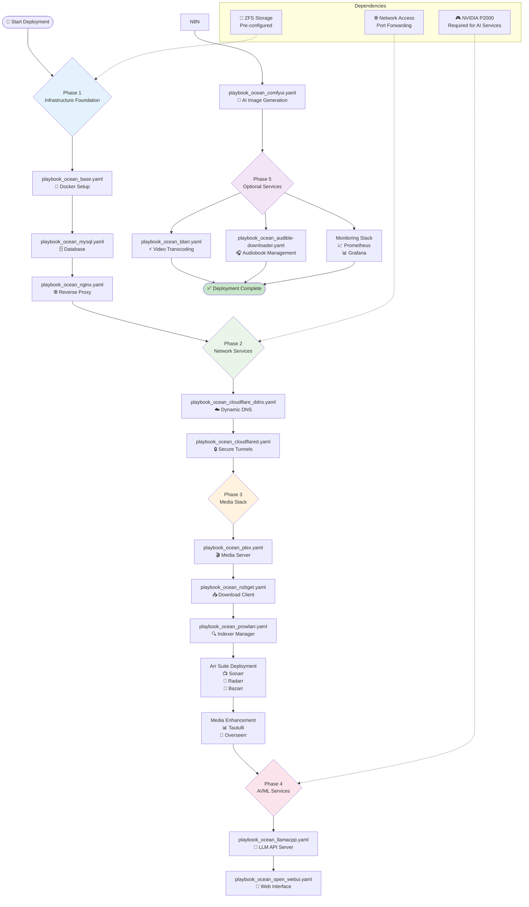

# Deployment Flow Diagram

```mermaid
flowchart TD
    Start([🚀 Start Deployment]) --> Phase1{Phase 1<br/>Infrastructure Foundation}
    
    Phase1 --> Base[playbook_ocean_base.yaml<br/>🐳 Docker Setup]
    Base --> MySQL[playbook_ocean_mysql.yaml<br/>🗄️ Database]
    MySQL --> Nginx[playbook_ocean_nginx.yaml<br/>🌐 Reverse Proxy]
    
    Nginx --> Phase2{Phase 2<br/>Network Services}
    Phase2 --> DDNS[playbook_ocean_cloudflare_ddns.yaml<br/>☁️ Dynamic DNS]
    DDNS --> Tunnels[playbook_ocean_cloudflared.yaml<br/>🔒 Secure Tunnels]
    
    Tunnels --> Phase3{Phase 3<br/>Media Stack}
    Phase3 --> Plex[playbook_ocean_plex.yaml<br/>🎬 Media Server]
    Plex --> NZBGet[playbook_ocean_nzbget.yaml<br/>📥 Download Client]
    NZBGet --> Prowlarr[playbook_ocean_prowlarr.yaml<br/>🔍 Indexer Manager]
    Prowlarr --> ArrSuite[Arr Suite Deployment<br/>📺 Sonarr<br/>🎥 Radarr<br/>💬 Bazarr]
    ArrSuite --> MediaEnhance[Media Enhancement<br/>📊 Tautulli<br/>🎫 Overseerr]
    
    MediaEnhance --> Phase4{Phase 4<br/>AI/ML Services}
    Phase4 --> LlamaAPI[playbook_ocean_llamacpp.yaml<br/>🧠 LLM API Server]
    LlamaAPI --> WebUI[playbook_ocean_open_webui.yaml<br/>💬 Web Interface]
    N8N --> ComfyUI[playbook_ocean_comfyui.yaml<br/>🎨 AI Image Generation]
    
    ComfyUI --> Phase5{Phase 5<br/>Optional Services}
    Phase5 --> Transcoding[playbook_ocean_tdarr.yaml<br/>⚡ Video Transcoding]
    Phase5 --> Audiobooks[playbook_ocean_audible-downloader.yaml<br/>🎧 Audiobook Management]
    Phase5 --> Monitoring[Monitoring Stack<br/>📈 Prometheus<br/>📊 Grafana]
    
    Transcoding --> Complete([✅ Deployment Complete])
    Audiobooks --> Complete
    Monitoring --> Complete
    
    subgraph "Dependencies"
        GPU[🎮 NVIDIA P2000<br/>Required for AI Services]
        ZFS[💾 ZFS Storage<br/>Pre-configured]
        Network[🌐 Network Access<br/>Port Forwarding]
    end
    
    GPU -.-> Phase4
    ZFS -.-> Phase1
    Network -.-> Phase2
    
    style Phase1 fill:#e3f2fd
    style Phase2 fill:#e8f5e8  
    style Phase3 fill:#fff3e0
    style Phase4 fill:#fce4ec
    style Phase5 fill:#f3e5f5
    style Complete fill:#c8e6c9
```
