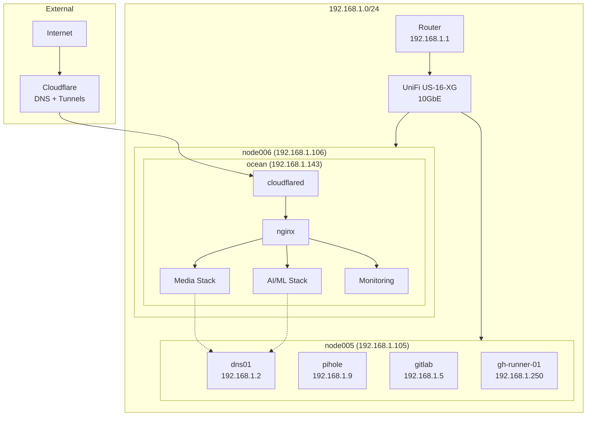

# Network Topology

Homelab network topology diagram.

---

## Overview



---

## Host Summary

| Host | IP | Location |
|------|----|----------|
| node005 | 192.168.1.105 | Physical |
| node006 | 192.168.1.106 | Physical |
| dns01 | 192.168.1.2 | VM on node005 |
| pihole | 192.168.1.9 | VM on node005 |
| gitlab | 192.168.1.5 | VM on node005 |
| gh-runner-01 | 192.168.1.250 | VM on node005 |
| ocean | 192.168.1.143 | VM on node006 |

---

## Traffic Flow

**External Access:**

```text
Internet → Cloudflare → cloudflared (ocean) → nginx → service
```

**Internal DNS:**

```text
Client → pihole (192.168.1.9) → dns01 (192.168.1.2) → resolution
```

---

See [networking.md](networking.md) for detailed configuration.
