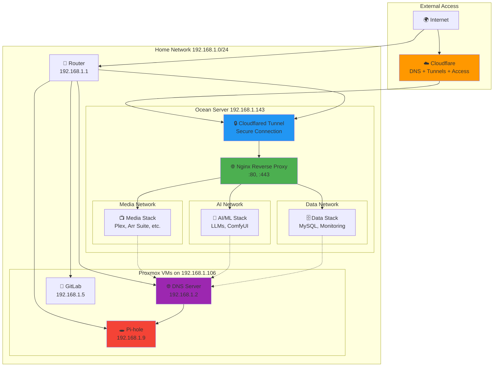

# Network Topology Diagram

```mermaid
graph TB
    subgraph "External Access"
        Internet[🌍 Internet]
        CF[☁️ Cloudflare<br/>DNS + Tunnels + Access]
    end
    
    subgraph "Home Network 192.168.1.0/24"
        Router[🔌 Router<br/>192.168.1.1]
        
        subgraph "Ocean Server 192.168.1.143"
            CFT[🔒 Cloudflared Tunnel<br/>Secure Connection]
            RP[🌐 Nginx Reverse Proxy<br/>:80, :443]
            
            subgraph "Media Network"
                MediaServices[📺 Media Stack<br/>Plex, Arr Suite, etc.]
            end
            
            subgraph "AI Network" 
                AIServices[🧠 AI/ML Stack<br/>LLMs, ComfyUI]
            end
            
            subgraph "Data Network"
                DataServices[🗄️ Data Stack<br/>MySQL, Monitoring]
            end
        end
        
        subgraph "Proxmox VMs on 192.168.1.106"
            DNS[🌐 DNS Server<br/>192.168.1.2]
            PiHole[🕳️ Pi-hole<br/>192.168.1.9] 
            GitLab[🦊 GitLab<br/>192.168.1.5]
        end
    end
    
    Internet --> CF
    CF --> CFT
    CFT --> RP
    RP --> MediaServices
    RP --> AIServices
    RP --> DataServices
    
    Internet --> Router
    Router --> DNS
    Router --> PiHole
    Router --> GitLab
    Router --> CFT
    
    DNS --> PiHole
    MediaServices -.-> DNS
    AIServices -.-> DNS
    DataServices -.-> DNS
    
    style CF fill:#ff9800
    style CFT fill:#2196f3
    style RP fill:#4caf50
    style DNS fill:#9c27b0
    style PiHole fill:#f44336
```
