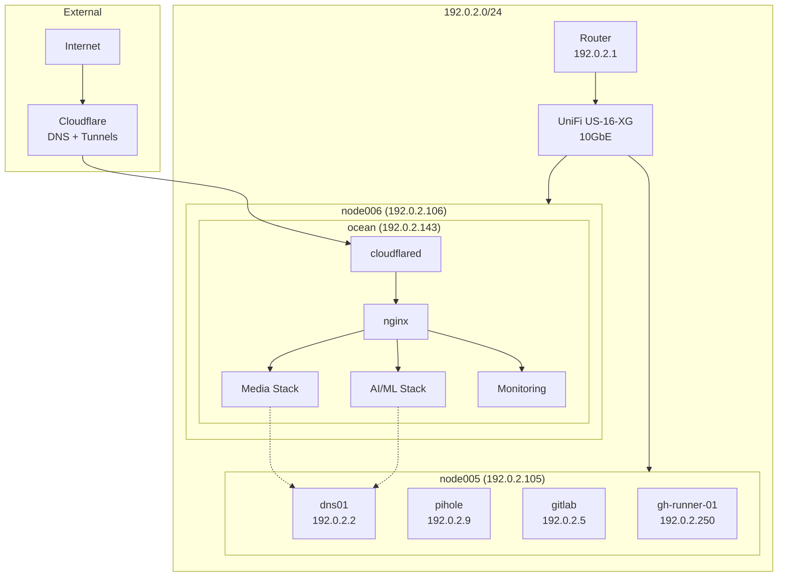

# Network Topology

Homelab network topology diagram.

---

## Overview


```mermaid
graph TB
    subgraph External
        Internet[Internet]
        CF[Cloudflare<br/>DNS + Tunnels]
    end
    
    subgraph Network["192.0.2.0/24"]
        Router[Router<br/>192.0.2.1]
        Switch[UniFi US-16-XG<br/>10GbE]
        
        subgraph node005["node005 (192.0.2.105)"]
            DNS[dns01<br/>192.0.2.2]
            PiHole[pihole<br/>192.0.2.9]
            GitLab[gitlab<br/>192.0.2.5]
            Runner[gh-runner-01<br/>192.0.2.250]
        end
        
        subgraph node006["node006 (192.0.2.106)"]
            subgraph ocean["ocean (192.0.2.143)"]
                CFT[cloudflared]
                RP[nginx]
                Media[Media Stack]
                AI[AI/ML Stack]
                Mon[Monitoring]
            end
        end
    end
    
    Internet --> CF
    CF --> CFT
    CFT --> RP
    RP --> Media
    RP --> AI
    RP --> Mon
    
    Router --> Switch
    Switch --> node005
    Switch --> node006
    
    Media -.-> DNS
    AI -.-> DNS
```

---

## Host Summary

| Host | IP | Location |
|------|----|----------|
| node005 | 192.0.2.105 | Physical |
| node006 | 192.0.2.106 | Physical |
| dns01 | 192.0.2.2 | VM on node005 |
| pihole | 192.0.2.9 | VM on node005 |
| gitlab | 192.0.2.5 | VM on node005 |
| gh-runner-01 | 192.0.2.250 | VM on node005 |
| ocean | 192.0.2.143 | VM on node006 |

---

## Traffic Flow

**External Access:**

```text
Internet → Cloudflare → cloudflared (ocean) → nginx → service
```

**Internal DNS:**

```text
Client → pihole (192.0.2.9) → dns01 (192.0.2.2) → resolution
```

---

See [networking.md](networking.md) for detailed configuration.
