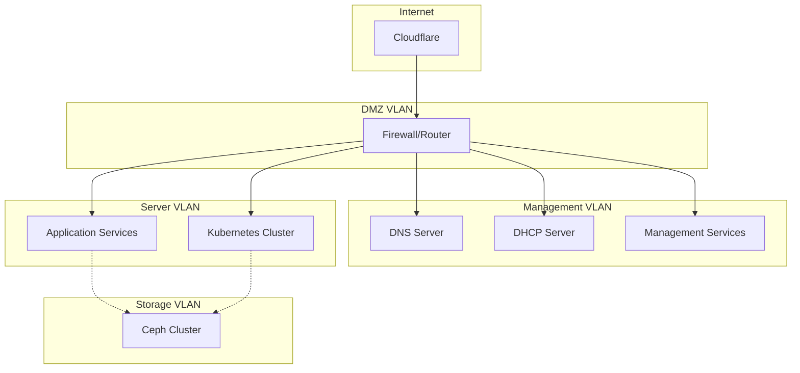

# 🌐 Network Architecture

## Overview

The homelab network is designed with performance, redundancy, and security in mind, utilizing bonded interfaces, VLANs, and multiple network tiers for different service types.

## 🏗️ Physical Network Infrastructure

### Network Equipment
- **Core Switch**: 10GbE managed switch with LACP support
- **Access Switches**: 1GbE switches for management and IoT devices  
- **Firewall**: pfSense or equivalent with VLAN support
- **Internet**: Fiber connection with static IP allocation

### Interface Configuration

#### Proxmox Host Bonding
```bash
# Primary bond configuration (802.3ad LACP)
auto bond0
iface bond0 inet manual
    bond-slaves eno1 eno2
    bond-miimon 100
    bond-mode 802.3ad
    bond-xmit-hash-policy layer3+4
```

#### Bridge Configuration
```bash
# Main bridge for VM traffic
auto vmbr0
iface vmbr0 inet static
    address 192.168.1.106/24
    gateway 192.168.1.1
    bridge-ports bond0
    bridge-stp off
    bridge-fd 0
```

## 🏷️ VLAN Structure

| VLAN ID | Name | Subnet | Purpose |
|---------|------|---------|---------|
| 1 | Management | 192.168.1.0/24 | Host management, core services |
| 10 | Servers | 192.168.10.0/24 | VM and container services |
| 20 | IoT | 192.168.20.0/24 | Smart home devices |
| 30 | Guest | 192.168.30.0/24 | Guest network isolation |
| 100 | Storage | 10.0.100.0/24 | Ceph cluster communication |

## 📍 IP Address Allocation

### Static Reservations (Management VLAN)
```yaml
# Core Infrastructure
gateway: 192.168.1.1
dns_primary: 192.168.1.2      # BIND DNS server
pi_hole: 192.168.1.9          # Ad-blocking DNS
k8s_api_vip: 192.168.1.99     # Kubernetes API server VIP

# Proxmox Hosts
proxmox01: 192.168.1.106      # Primary hypervisor
proxmox02: 192.168.1.107      # Secondary hypervisor

# Service Hosts
ocean: 192.168.1.143          # Docker services host
gitlab: 192.168.1.150         # GitLab server

# Kubernetes Cluster
k8s-master01: 192.168.1.101
k8s-master02: 192.168.1.102  
k8s-master03: 192.168.1.103
k8s-worker01: 192.168.1.111
k8s-worker02: 192.168.1.112
k8s-worker03: 192.168.1.113
```

### Dynamic Ranges
- **DHCP Pool**: 192.168.1.200-250 (client devices)
- **Reserved**: 192.168.1.50-99 (future static allocations)

## 🔗 Kubernetes Networking

### Cluster Networking (CNI: Cilium)
```yaml
cluster_cidr: "10.0.0.0/16"      # Pod network range
service_cidr: "10.0.250.0/20"    # Service network range  
node_cidr_mask_size: 16           # Per-node pod subnet size
```

### Network Policies
```yaml
# Default deny-all ingress
apiVersion: networking.k8s.io/v1
kind: NetworkPolicy
metadata:
  name: default-deny-ingress
spec:
  podSelector: {}
  policyTypes:
  - Ingress
```

### LoadBalancer Integration
- **MetalLB**: For bare-metal load balancer services
- **BGP Mode**: Integration with network equipment
- **IP Pool**: 192.168.1.160-180 for external services

## 🚀 High-Performance Features

### Bonding & Aggregation
- **LACP (802.3ad)**: Active-active load balancing
- **Hash Policy**: Layer3+4 for optimal distribution
- **Monitoring**: miimon for link state detection

### Jumbo Frames
```bash
# Enable on storage network for better throughput
echo 'iface bond0 inet manual
    mtu 9000' >> /etc/network/interfaces
```

### SR-IOV (Future)
- **GPU Networking**: Direct hardware access for AI workloads
- **Storage Acceleration**: Bypass kernel for high-IOPS workloads

## 🛡️ Security Architecture

### Network Segmentation


### Firewall Rules
```bash
# Allow core services
allow 192.168.1.0/24 -> 192.168.1.2:53    # DNS
allow 192.168.1.0/24 -> 192.168.1.2:67    # DHCP
allow 192.168.1.0/24 -> 192.168.1.9:53    # Pi-hole

# Block inter-VLAN by default
deny 192.168.10.0/24 -> 192.168.20.0/24
deny 192.168.20.0/24 -> 192.168.10.0/24

# Allow specific cross-VLAN services
allow 192.168.10.0/24 -> 192.168.1.2:53   # Servers to DNS
```

## 🔍 DNS Architecture

### BIND Configuration
```bind
// Primary zone for internal domain
zone "home" {
    type master;
    file "/etc/bind/db.home";
    allow-update { key "ddns-key"; };
    allow-transfer { 192.168.1.9; };  // Pi-hole as secondary
};

// Reverse DNS
zone "1.168.192.in-addr.arpa" {
    type master; 
    file "/etc/bind/db.192.168.1";
    allow-update { key "ddns-key"; };
};
```

### Dynamic DNS Integration
```bash
# Cloudflare DDNS for external services
curl -X PUT "https://api.cloudflare.com/client/v4/zones/$ZONE_ID/dns_records/$RECORD_ID" \
  -H "Authorization: Bearer $CF_TOKEN" \
  -H "Content-Type: application/json" \
  --data '{"type":"A","name":"homelab","content":"'$PUBLIC_IP'"}'
```

### Service Discovery
- **Internal**: .home domain for all internal services
- **External**: .terrac.com domain via Cloudflare tunnels
- **Kubernetes**: .svc.cluster.local for service mesh

## 📊 Monitoring & Observability

### Network Metrics Collection
```yaml
# Prometheus exporters
- node_exporter:     # Interface statistics
- snmp_exporter:     # Switch/router metrics  
- blackbox_exporter: # Network connectivity probes
```

### Key Metrics to Track
- **Bandwidth Utilization**: Per-interface throughput
- **Packet Loss**: Network reliability indicators
- **Latency**: Round-trip time between critical services
- **DNS Query Times**: Resolution performance
- **Connection Tracking**: Firewall state table usage

### Grafana Dashboards
- **Network Overview**: Aggregate traffic and health
- **Per-Host Details**: Individual system performance
- **Storage Network**: Ceph cluster communication
- **Application Connectivity**: Service-to-service latency

## 🔧 Troubleshooting Tools

### Network Diagnostics
```bash
# Interface status and statistics
ip link show
ip addr show
ethtool bond0

# Routing and connectivity  
ip route show
ping -c 4 192.168.1.1
traceroute google.com

# DNS resolution testing
nslookup gitlab.home 192.168.1.2
dig @192.168.1.9 +short blocked-domain.com

# Performance testing
iperf3 -s                    # Server mode
iperf3 -c 192.168.1.143     # Client test to ocean host
```

### Packet Capture
```bash
# Capture on specific interface
tcpdump -i vmbr0 -w /tmp/network.pcap

# Filter for specific traffic
tcpdump -i any host 192.168.1.143 and port 443

# Real-time monitoring
sudo ss -tulpn | grep :443   # Check listening services
```

## 🚀 Performance Optimization

### Kernel Network Tuning
```bash
# /etc/sysctl.d/99-network-performance.conf
net.core.rmem_max = 268435456
net.core.wmem_max = 268435456  
net.ipv4.tcp_rmem = 4096 65536 268435456
net.ipv4.tcp_wmem = 4096 65536 268435456
net.core.netdev_max_backlog = 30000
```

### Ceph Network Optimization
```yaml
# Ceph cluster and public networks
cluster_network: 10.0.100.0/24  # Dedicated storage VLAN
public_network: 192.168.1.0/24   # Client access network

# Performance tuning
ms_bind_port_min: 6800
ms_bind_port_max: 7300
```

## 📅 Future Enhancements

### Network Evolution
1. **25GbE Backbone**: Upgrade core switching for higher throughput
2. **RDMA/InfiniBand**: Ultra-low latency for storage and AI workloads  
3. **Network Function Virtualization**: Software-defined networking
4. **Service Mesh**: Istio for advanced traffic management
5. **Edge Computing**: 5G integration for remote services

### Security Improvements  
1. **Zero Trust Architecture**: Mutual TLS for all internal traffic
2. **Network Access Control**: 802.1X authentication
3. **Advanced Threat Detection**: AI-powered anomaly detection
4. **Microsegmentation**: Container-level network policies

This network architecture provides the foundation for a scalable, secure, and high-performance homelab environment that can grow with your needs while maintaining enterprise-grade capabilities.
