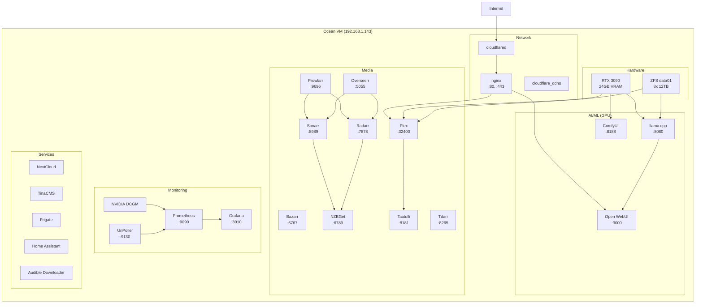

# Ocean Services Architecture

Services running on ocean VM (192.168.1.143).

---

## Service Diagram



---

## Service List

| Category | Services |
|----------|----------|
| Network | nginx, cloudflared, cloudflare_ddns |
| AI/ML | llama.cpp, Open WebUI, ComfyUI |
| Media | Plex, Sonarr, Radarr, Prowlarr, Bazarr, NZBGet, Overseerr, Tautulli, Tdarr |
| Monitoring | Prometheus, Grafana, NVIDIA DCGM, UnPoller |
| Services | NextCloud, TinaCMS, Audible Downloader, Frigate, Home Assistant |

---

## Deploy

```bash
ansible-playbook -i inventories/production/hosts.ini \
  playbooks/03_ocean_services.yaml --ask-vault-pass
```

See [deployment-flow.md](deployment-flow.md) for service order.
