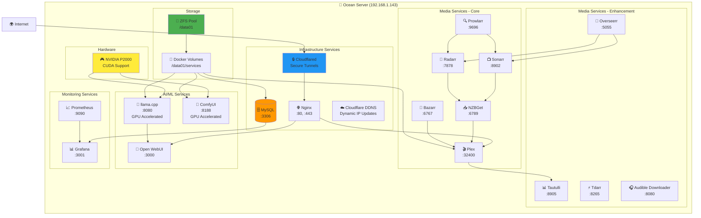

# Ocean Server Services Architecture

```mermaid
graph TB
    subgraph "🐋 Ocean Server (192.168.1.143)"
        subgraph "Infrastructure Services"
            MySQL[(🗄️ MySQL<br/>:3306)]
            Nginx[🌐 Nginx<br/>:80, :443]
            DDNS[☁️ Cloudflare DDNS<br/>Dynamic IP Updates]
            Cloudflared[🔒 Cloudflared<br/>Secure Tunnels]
        end
        
        subgraph "Media Services - Core"
            Plex[🎬 Plex<br/>:32400]
            NZBGet[📥 NZBGet<br/>:6789]
            Prowlarr[🔍 Prowlarr<br/>:9696]
            Sonarr[📺 Sonarr<br/>:8902]
            Radarr[🎥 Radarr<br/>:7878]
            Bazarr[💬 Bazarr<br/>:6767]
        end
        
        subgraph "Media Services - Enhancement"
            Tautulli[📊 Tautulli<br/>:8905]
            Overseerr[🎫 Overseerr<br/>:5055]
            Tdarr[⚡ Tdarr<br/>:8265]
            Audible[🎧 Audible Downloader<br/>:8080]
        end
        
        subgraph "AI/ML Services"
            LlamaCpp[🧠 llama.cpp<br/>:8080<br/>GPU Accelerated]
            OpenWebUI[💬 Open WebUI<br/>:3000]
            ComfyUI[🎨 ComfyUI<br/>:8188<br/>GPU Accelerated]
        end
        
        subgraph "Monitoring Services"
            Prometheus[📈 Prometheus<br/>:9090]
            Grafana[📊 Grafana<br/>:3001]
        end
        
        subgraph "Storage"
            ZFS[💾 ZFS Pool<br/>/data01]
            Docker[🐳 Docker Volumes<br/>/data01/services]
        end
        
        subgraph "Hardware"
            GPU[🎮 NVIDIA P2000<br/>CUDA Support]
        end
    end
    
    Internet[🌍 Internet] --> Cloudflared
    Cloudflared --> Nginx
    Nginx --> Plex
    Nginx --> OpenWebUI
    MySQL --> Grafana
    
    Prowlarr --> Sonarr
    Prowlarr --> Radarr
    Sonarr --> NZBGet
    Radarr --> NZBGet
    NZBGet --> Plex
    Bazarr --> Plex
    
    Plex --> Tautulli
    Overseerr --> Sonarr
    Overseerr --> Radarr
    
    LlamaCpp --> OpenWebUI
    GPU --> LlamaCpp
    GPU --> ComfyUI
    
    Prometheus --> Grafana
    
    ZFS --> Docker
    Docker --> Plex
    Docker --> MySQL
    Docker --> LlamaCpp
    Docker --> ComfyUI
    
    style GPU fill:#ffeb3b
    style ZFS fill:#4caf50
    style MySQL fill:#ff9800
    style Cloudflared fill:#2196f3
```
