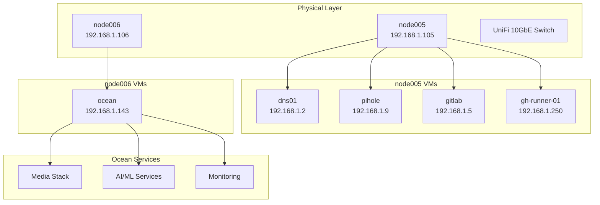

# Architecture Overview

Homelab infrastructure architecture and design.

---

## Infrastructure Summary

| Host | IP | Hardware | Purpose |
|------|----|----------|---------|
| node005 | 192.168.1.105 | Dell R620 (56 cores, 128GB) | Proxmox - Control VMs |
| node006 | 192.168.1.106 | Dell R720 (40 cores, 680GB, RTX 3090) | Proxmox - Ocean VM |
| ocean | 192.168.1.143 | VM on node006 (30 cores, 256GB) | Docker services |
| dns01 | 192.168.1.2 | VM on node005 | BIND DNS |
| pihole | 192.168.1.9 | VM on node005 | DNS filtering |
| gitlab | 192.168.1.5 | VM on node005 | CI/CD |
| gh-runner-01 | 192.168.1.250 | VM on node005 | GitHub Actions runners |

---

## Architecture Diagram



---

## Storage

| Pool | Type | Location | Size |
|------|------|----------|------|
| data01 | ZFS raidz2 | ocean VM (node006) | 8x 12TB |
| local-lvm | LVM | node005 | VM boot disks |
| local-lvm | LVM | node006 | VM boot disks |

Ocean services mount `/data01/services/` for persistent storage.

---

## Network

| Component | IP | Purpose |
|-----------|-----|---------|
| Gateway | 192.168.1.1 | Router |
| dns01 | 192.168.1.2 | BIND DNS |
| pihole | 192.168.1.9 | DNS filtering |
| node005 | 192.168.1.105 | Proxmox |
| node006 | 192.168.1.106 | Proxmox |
| ocean | 192.168.1.143 | Docker services |

### Traffic Flow

1. **External**: Internet → Cloudflare → cloudflared tunnel → nginx → services
2. **Internal**: Client → pihole → dns01 → service resolution
3. **Metrics**: Exporters → Prometheus → Grafana

---

## Ocean Services

### Networking

- nginx (reverse proxy)
- cloudflared (Cloudflare tunnels)
- cloudflare_ddns (dynamic DNS)

### AI/ML (GPU)

- llama.cpp (LLM API server)
- Open WebUI (chat interface)
- ComfyUI (image generation)

### Media

- Plex, Sonarr, Radarr, Prowlarr, Bazarr
- NZBGet, Overseerr, Tautulli, Tdarr

### Monitoring

- Prometheus, Grafana
- NVIDIA DCGM, UnPoller

### Services

- NextCloud, TinaCMS
- Frigate, Home Assistant

---

## Deployment

All infrastructure managed via Ansible:

```bash
# Full deployment
ansible-playbook -i inventories/production/hosts.ini \
  playbooks/00_site.yaml --ask-vault-pass

# Ocean services only
ansible-playbook -i inventories/production/hosts.ini \
  playbooks/03_ocean_services.yaml --ask-vault-pass
```

See [deployment-flow.md](deployment-flow.md) for service order.

---

## Related Documentation

- [Network Design](networking.md)
- [Ocean Services](ocean-services.md)
- [Deployment Flow](deployment-flow.md)
