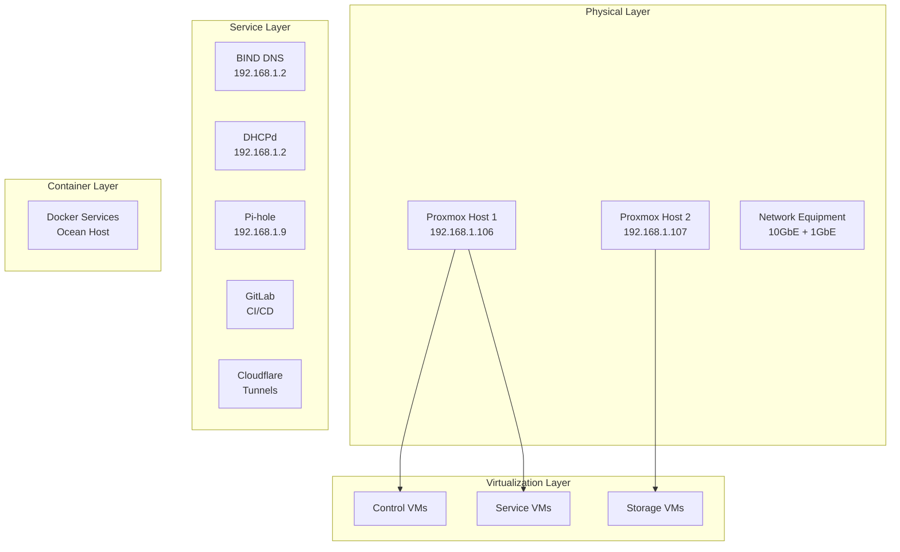

# 🏗️ Homelab Architecture Overview

## 🎯 Vision & Goals

### Core Principles
1. **🤖 Fully Automated** - Infrastructure as Code with minimal manual intervention
2. **🔐 SSH-Free Operations** - 99% of tasks handled through automation and web interfaces
3. **🛡️ Security First** - Publicly signed certificates, no self-signed anywhere
4. **📝 Git-Driven** - All infrastructure and services managed through version control
5. **📊 Observable** - Comprehensive logging and monitoring across all components
6. **🏢 Isolated Environments** - Proper separation between dev/staging/production
7. **⚡ High Availability** - Resilient architecture with redundancy for critical services

## 🏗️ System Architecture

### Infrastructure Layers

### Network Architecture

| Component | IP Range/Address | Purpose |
|-----------|------------------|---------|
| **Management Network** | 192.168.1.0/24 | Host management and services |
| **DNS Primary** | 192.168.1.2 | BIND DNS server |
| **Pi-hole** | 192.168.1.9 | Ad-blocking DNS |
| **Ocean Media Server** | 192.168.1.143 | Docker services host |

## 🔧 Component Overview

### Core Infrastructure
- **Proxmox VE Cluster** - Hypervisor platform with HA capabilities
- **Ceph Storage** - Distributed storage backend (CephFS + block storage)
- **BIND DNS** - Authoritative DNS with dynamic updates
- **DHCPd** - Network address management with reservations
- **Pi-hole** - Network-wide ad blocking and DNS filtering

### Automation & CI/CD
- **GitLab** - Source control, CI/CD pipelines, container registry  
- **Ansible** - Configuration management and deployment
- **Cloudflared** - Secure tunnel access without port forwarding
- **Rundeck** (Planned) - Job scheduling and workflow automation

### Container Platforms
- **Docker** - Single-host containerized services (media stack, AI services)

### Observability Stack
- **Grafana** - Metrics visualization and dashboards
- **Prometheus** - Metrics collection and alerting
- **Loki** (Planned) - Log aggregation and analysis
- **Tautulli** - Plex media server monitoring

### Security & Access
- **Cloudflare Access** - Zero-trust application access
- **SSH Key Management** - GitHub-based key distribution
- **Vault Secrets** - Centralized credential management
- **TLS Everywhere** - Public certificates for all services

## 📊 Service Distribution

### Ocean Host (192.168.1.143) - Docker Services
- **Media Stack**: Plex, Sonarr, Radarr, Tautulli, NZBGet, Overseerr
- **AI/ML Services**: N8N, Open WebUI, ComfyUI, llama.cpp
- **Monitoring**: Grafana, Prometheus, cAdvisor
- **Development**: Portainer, MySQL

### Control Plane Services
- **GitLab**: CI/CD, source control, container registry
- **DNS**: BIND with dynamic DNS updates
- **DHCP**: Centralized IP address management
- **Monitoring**: Infrastructure and application metrics

## 🔄 Data Flow & Integration

### Deployment Pipeline
1. **Code Changes** → GitLab repository
2. **CI Pipeline** → Automated testing and building
3. **Ansible Playbooks** → Infrastructure provisioning
4. **Container Deployment** → Docker containers
5. **Health Checks** → Monitoring and alerting

### Network Traffic Flow
1. **Internet** → Cloudflare → Tunnel → Services
2. **Internal** → Pi-hole DNS → BIND → Service Resolution
3. **Monitoring** → Prometheus → Grafana → Alerting

### Storage Architecture
- **Ceph Cluster** - Distributed storage backend
- **VM Disks** - Ceph RBD volumes
- **Shared Storage** - CephFS for application data
- **Backup Strategy** - Automated snapshots and replication

## 🚀 Evolution Roadmap

### Phase 1: Core Infrastructure ✅
- Proxmox cluster with Ceph storage
- DNS/DHCP services
- Basic VM provisioning

### Phase 2: Automation & Services ✅ 
- Ansible automation
- Docker service stack
- Monitoring foundation
- Cloudflare tunnels

### Phase 3: Advanced Features 🔄
- Service discovery for Docker
- Advanced monitoring with Loki
- Enhanced security controls

### Phase 4: Enterprise Features 📅
- Multi-environment isolation
- Disaster recovery automation
- Advanced security controls
- Performance optimization

## 📈 Scalability Considerations

### Horizontal Scaling
- **Proxmox Nodes**: Add additional hypervisors to cluster
- **Docker Hosts**: Add additional Docker service hosts
- **Ceph OSDs**: Expand storage capacity
- **Service Replicas**: Scale individual applications

### Vertical Scaling  
- **CPU/Memory**: Upgrade hypervisor hardware
- **Storage Performance**: NVMe tiers for hot data
- **Network Bandwidth**: 25GbE+ for high-throughput workloads

This architecture provides a solid foundation for a production-ready homelab with enterprise-grade capabilities while maintaining simplicity and automation-first principles.
