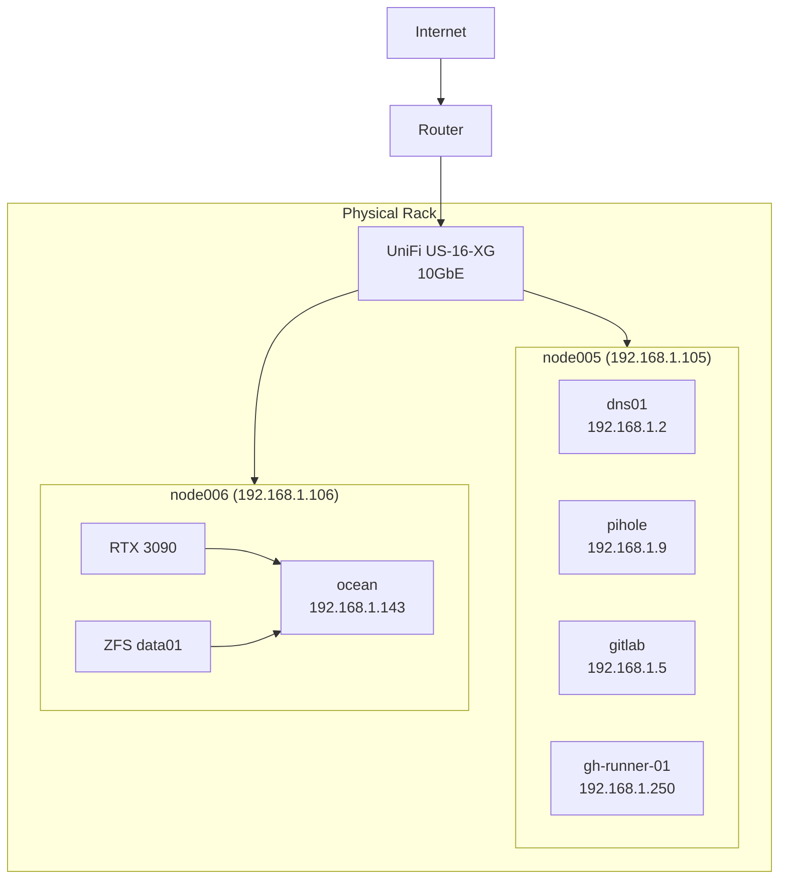
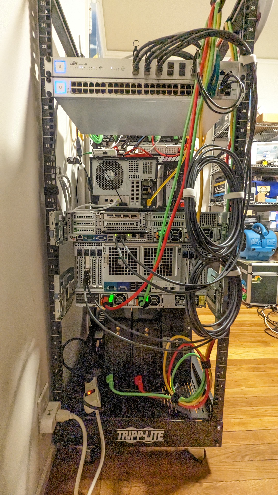

# Physical Architecture

Physical server layout and rack diagram.

---

## Rack Diagram

```text
┌─────────────────────────────────────────────────────────────┐
│                        42U Rack                             │
├─────────────────────────────────────────────────────────────┤
│  U1-2   │ UniFi US-16-XG (10GbE Switch)                     │
├─────────────────────────────────────────────────────────────┤
│  U3-4   │ UniFi USW (1GbE Switch)                           │
├─────────────────────────────────────────────────────────────┤
│  U5-6   │ Patch Panel                                       │
├─────────────────────────────────────────────────────────────┤
│         │                                                   │
│  U7-8   │ node005 - Dell R620                               │
│         │ 56 cores, 128GB RAM                               │
│         │ 192.168.1.105                                     │
│         │ VMs: dns01, pihole, gitlab, gh-runner-01          │
├─────────────────────────────────────────────────────────────┤
│         │                                                   │
│  U9-10  │ node006 - Dell R720                               │
│         │ 40 cores, 680GB RAM, RTX 3090                     │
│         │ 192.168.1.106                                     │
│         │ VMs: ocean (Docker services)                      │
├─────────────────────────────────────────────────────────────┤
│  U11-14 │ UPS / Power Distribution                          │
├─────────────────────────────────────────────────────────────┤
│  U15+   │ (Available)                                       │
└─────────────────────────────────────────────────────────────┘
```

---

## Server Specifications

### node005 (Dell R620)

| Component | Specification |
|-----------|---------------|
| CPU | 2x Intel Xeon E5-2690 v2 (56 cores total) |
| RAM | 128GB DDR3 ECC |
| Storage | Local LVM for VM boot disks |
| Network | 2x 10GbE (bond0 LACP) |
| IP | 192.168.1.105 |

**VMs hosted:**

- dns01 (192.168.1.2) - BIND DNS
- pihole (192.168.1.9) - DNS filtering
- gitlab (192.168.1.5) - CI/CD
- gh-runner-01 (192.168.1.250) - GitHub Actions

### node006 (Dell R720)

| Component | Specification |
|-----------|---------------|
| CPU | 2x Intel Xeon E5-2680 v2 (40 cores total) |
| RAM | 680GB DDR3 ECC |
| GPU | NVIDIA RTX 3090 (24GB VRAM) - passthrough |
| Storage | Local LVM + SAS controller passthrough |
| Network | 2x 10GbE (bond0 LACP) |
| IP | 192.168.1.106 |

**VMs hosted:**

- ocean (192.168.1.143) - Docker services, ZFS storage

---

## Network Diagram



---

## Photos




---

## Related Documentation

- [Dell Hardware Operations](/docs/operations/dell-hardware.md)
- [GPU Management](/docs/operations/gpu-management.md)
- [Ocean Migration Plan](/docs/operations/ocean-migration-plan.md)
