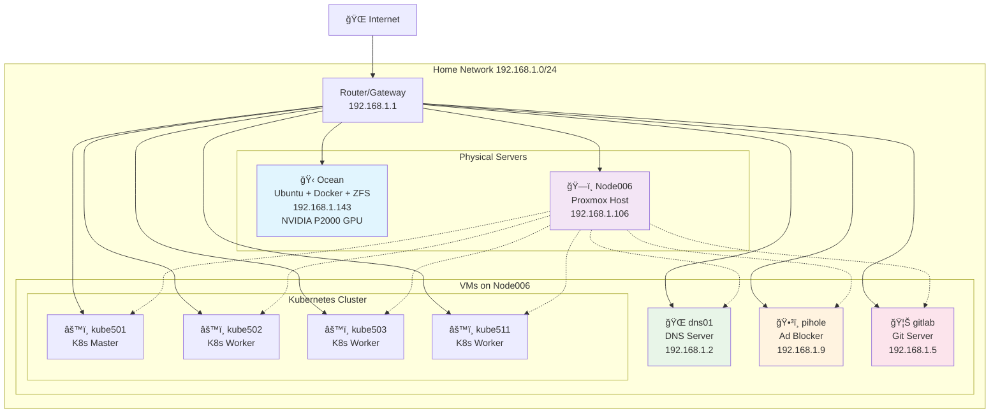

# Physical Architecture Diagram

```mermaid
graph TB
    subgraph "Home Network 192.168.1.0/24"
        Router[Router/Gateway<br/>192.168.1.1]
        
        subgraph "Physical Servers"
            Ocean[🋠Ocean<br/>Ubuntu + Docker + ZFS<br/>192.168.1.143<br/>NVIDIA P2000 GPU]
            Node006[ğŸ—ï¸ Node006<br/>Proxmox Host<br/>192.168.1.106]
        end
        
        subgraph "VMs on Node006"
            DNS01[🌠dns01<br/>DNS Server<br/>192.168.1.2]
            Pihole[ğŸ•³ï¸ pihole<br/>Ad Blocker<br/>192.168.1.9]
            Gitlab[🦊 gitlab<br/>Git Server<br/>192.168.1.5]
            
            subgraph "Kubernetes Cluster"
                K501[âš™ï¸ kube501<br/>K8s Master]
                K502[âš™ï¸ kube502<br/>K8s Worker]  
                K503[âš™ï¸ kube503<br/>K8s Worker]
                K511[âš™ï¸ kube511<br/>K8s Worker]
            end
        end
    end
    
    Internet[🌠Internet] --> Router
    Router --> Ocean
    Router --> Node006
    Router --> DNS01
    Router --> Pihole
    Router --> Gitlab
    Router --> K501
    Router --> K502
    Router --> K503
    Router --> K511
    
    Node006 -.-> DNS01
    Node006 -.-> Pihole
    Node006 -.-> Gitlab
    Node006 -.-> K501
    Node006 -.-> K502
    Node006 -.-> K503
    Node006 -.-> K511
    
    style Ocean fill:#e1f5fe
    style Node006 fill:#f3e5f5
    style DNS01 fill:#e8f5e8
    style Pihole fill:#fff3e0
    style Gitlab fill:#fce4ec
```
