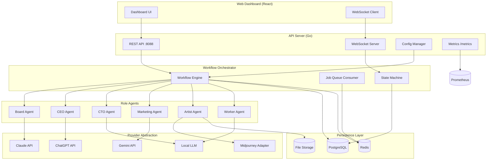

# AI Corporation - Architecture

A FOSS "AI Corporation" workflow engine using LLMs as virtual employees (Board, CEO, CTO, Marketing, Artist, Workers).

## Overview

AI Corporation orchestrates multi-agent workflows where different LLM "roles" collaborate to generate business ideas, evaluate feasibility, create marketing content, and produce visual assets.

## System Architecture

```text
┌─────────────────────────────────────────────────────────────────────────────────┐
│                              AI Corporation System                               │
├─────────────────────────────────────────────────────────────────────────────────┤
│                                                                                  │
│  ┌──────────────────┐     ┌──────────────────────────────────────────────────┐  │
│  │   Web Dashboard  │     │                  API Server                      │  │
│  │   (React+Vite)   │────▶│  - REST endpoints (/api/v1/...)                  │  │
│  │   Port 3000      │     │  - WebSocket for live updates                    │  │
│  └──────────────────┘     │  - Port 8088                                     │  │
│                           └──────────────────────────────────────────────────┘  │
│                                          │                                       │
│                                          ▼                                       │
│  ┌───────────────────────────────────────────────────────────────────────────┐  │
│  │                        Workflow Orchestrator                               │  │
│  │  - Executes workflow definitions                                          │  │
│  │  - Manages step transitions                                               │  │
│  │  - Handles role agent invocations                                         │  │
│  │  - Tracks state and artifacts                                             │  │
│  └───────────────────────────────────────────────────────────────────────────┘  │
│                                          │                                       │
│            ┌─────────────────────────────┼─────────────────────────────┐        │
│            ▼                             ▼                             ▼        │
│  ┌──────────────────┐     ┌──────────────────┐     ┌──────────────────┐        │
│  │    Role Agents   │     │    Role Agents   │     │    Role Agents   │        │
│  │  ┌────────────┐  │     │  ┌────────────┐  │     │  ┌────────────┐  │        │
│  │  │   Board    │  │     │  │    CEO     │  │     │  │    CTO     │  │        │
│  │  │ (Strategy) │  │     │  │ (Decisions)│  │     │  │(Feasibility│  │        │
│  │  └────────────┘  │     │  └────────────┘  │     │  └────────────┘  │        │
│  │  ┌────────────┐  │     │  ┌────────────┐  │     │  ┌────────────┐  │        │
│  │  │ Marketing  │  │     │  │   Artist   │  │     │  │  Workers   │  │        │
│  │  │ (Content)  │  │     │  │  (Images)  │  │     │  │  (Tasks)   │  │        │
│  │  └────────────┘  │     │  └────────────┘  │     │  └────────────┘  │        │
│  └──────────────────┘     └──────────────────┘     └──────────────────┘        │
│            │                             │                             │        │
│            └─────────────────────────────┼─────────────────────────────┘        │
│                                          ▼                                       │
│  ┌───────────────────────────────────────────────────────────────────────────┐  │
│  │                    Provider Abstraction Layer                              │  │
│  │  ┌─────────────┐  ┌─────────────┐  ┌─────────────┐  ┌─────────────┐      │  │
│  │  │   Claude    │  │   Gemini    │  │  ChatGPT    │  │  Local LLM  │      │  │
│  │  │  (Anthropic)│  │  (Google)   │  │  (OpenAI)   │  │ (llama.cpp) │      │  │
│  │  └─────────────┘  └─────────────┘  └─────────────┘  └─────────────┘      │  │
│  │                                                                            │  │
│  │  ┌─────────────────────────────────────────────────────────────────────┐  │  │
│  │  │                      Midjourney Adapter                              │  │  │
│  │  │  (REST/Webhook integration for image generation)                     │  │  │
│  │  └─────────────────────────────────────────────────────────────────────┘  │  │
│  └───────────────────────────────────────────────────────────────────────────┘  │
│                                          │                                       │
│            ┌─────────────────────────────┼─────────────────────────────┐        │
│            ▼                             ▼                             ▼        │
│  ┌──────────────────┐     ┌──────────────────┐     ┌──────────────────┐        │
│  │    PostgreSQL    │     │      Redis       │     │   File Storage   │        │
│  │  - Workflows     │     │  - Job Queue     │     │  - Artifacts     │        │
│  │  - Run History   │     │  - Rate Limits   │     │  - Images        │        │
│  │  - Artifacts     │     │  - Caching       │     │  - Exports       │        │
│  │  Port 5434       │     │  Port 6381       │     │  /data01/...     │        │
│  └──────────────────┘     └──────────────────┘     └──────────────────┘        │
│                                                                                  │
└─────────────────────────────────────────────────────────────────────────────────┘
```

## Mermaid Diagram



## Component Details

### 1. Configuration Manager

**File**: `config.ini`

```ini
[server]
port = 8088
host = 0.0.0.0
log_level = info

[database]
host = postgres
port = 5432
name = ai_corp
user = ai_corp

[redis]
addr = redis:6379
db = 0

[providers]
default = local
enable_mcp = false
enable_midjourney = false

[providers.local]
type = openai_compatible
url = http://192.168.1.143:8080
api_key = 
model = default

[providers.openai]
type = openai
api_key = ${OPENAI_API_KEY}
model = gpt-4o

[providers.anthropic]
type = anthropic
api_key = ${ANTHROPIC_API_KEY}
model = claude-3-5-sonnet-20241022

[providers.google]
type = google
api_key = ${GOOGLE_API_KEY}
model = gemini-1.5-pro

[midjourney]
enabled = false
api_url = 
api_key = ${MIDJOURNEY_API_KEY}
webhook_url = http://192.168.1.143:8088/webhook/midjourney

[roles.board]
name = Board of Directors
provider = openai
persona = You are the Board of Directors. You set strategic direction, evaluate major decisions, and approve or reject proposals. Focus on long-term value, risk assessment, and market positioning.

[roles.ceo]
name = CEO
provider = openai
persona = You are the CEO. You make executive decisions, prioritize initiatives, and coordinate between departments. Balance innovation with practicality.

[roles.cto]
name = CTO
provider = local
persona = You are the CTO. You evaluate technical feasibility, estimate effort, identify risks, and propose architecture. Be specific about technologies and timelines.

[roles.marketing]
name = Marketing Director
provider = google
persona = You are the Marketing Director. You analyze market fit, craft positioning, write copy, and plan go-to-market strategies. Focus on audience and differentiation.

[roles.artist]
name = Creative Director
provider = midjourney
persona = You create visual assets. Translate concepts into image prompts and manage visual brand identity.

[roles.worker]
name = Task Worker
provider = local
persona = You execute specific tasks as assigned. Be thorough, follow instructions precisely, and report results clearly.

[workflows]
templates_dir = /app/workflows

[limits]
max_concurrent_workflows = 5
max_steps_per_workflow = 50
rate_limit_rpm = 60
context_cache_ttl = 3600
```

### 2. Workflow Definitions

Workflows are defined in YAML files in the `workflows/` directory:

```yaml
# workflows/business_idea.yaml
name: business_idea_pipeline
description: Generate and evaluate a business idea end-to-end
version: "1.0"

inputs:
  - name: domain
    type: string
    description: Business domain to explore
    required: true
  - name: budget
    type: string
    description: Budget constraints
    default: "bootstrapped"

steps:
  - id: ideation
    name: Generate Ideas
    role: board
    action: generate
    prompt_template: |
      Generate 3 innovative business ideas in the {{.domain}} domain.
      Budget constraint: {{.budget}}
      For each idea provide: name, one-liner, target audience, revenue model.
    outputs:
      - name: ideas
        type: json

  - id: ceo_select
    name: CEO Selection
    role: ceo
    action: decide
    depends_on: [ideation]
    prompt_template: |
      Review these business ideas and select the most promising one:
      {{.ideas}}
      Explain your selection criteria and decision.
    outputs:
      - name: selected_idea
        type: json
      - name: rationale
        type: text

  - id: technical_review
    name: Technical Feasibility
    role: cto
    action: analyze
    depends_on: [ceo_select]
    prompt_template: |
      Analyze technical feasibility of: {{.selected_idea}}
      Provide: tech stack recommendation, MVP timeline, risk assessment, effort estimate.
    outputs:
      - name: tech_analysis
        type: json

  - id: market_analysis
    name: Market Analysis
    role: marketing
    action: analyze
    depends_on: [ceo_select]
    prompt_template: |
      Analyze market opportunity for: {{.selected_idea}}
      Provide: target segments, positioning, competitive analysis, go-to-market plan.
    outputs:
      - name: market_analysis
        type: json

  - id: board_approval
    name: Board Approval
    role: board
    action: decide
    depends_on: [technical_review, market_analysis]
    prompt_template: |
      Review and decide on proceeding with: {{.selected_idea}}
      Technical analysis: {{.tech_analysis}}
      Market analysis: {{.market_analysis}}
      Vote: APPROVE or REJECT with reasoning.
    outputs:
      - name: decision
        type: enum
        values: [approve, reject]
      - name: conditions
        type: text

  - id: create_assets
    name: Create Visual Assets
    role: artist
    action: generate_image
    depends_on: [board_approval]
    condition: "{{.decision}} == 'approve'"
    prompt_template: |
      Create a logo concept for: {{.selected_idea.name}}
      Style: modern, minimal, professional
    outputs:
      - name: logo_url
        type: url

on_success:
  - action: notify
    channel: webhook
    
on_failure:
  - action: notify
    channel: webhook
  - action: retry
    max_attempts: 3
    backoff: exponential
```

### 3. API Endpoints

| Method | Endpoint | Description |
|--------|----------|-------------|
| `GET` | `/health` | Health check with component status |
| `GET` | `/metrics` | Prometheus metrics |
| `GET` | `/api/v1/workflows` | List workflow templates |
| `POST` | `/api/v1/workflows/{id}/run` | Start a workflow run |
| `GET` | `/api/v1/runs` | List workflow runs |
| `GET` | `/api/v1/runs/{id}` | Get run details with steps |
| `POST` | `/api/v1/runs/{id}/cancel` | Cancel a running workflow |
| `GET` | `/api/v1/runs/{id}/artifacts` | Get run artifacts |
| `GET` | `/api/v1/roles` | List configured roles |
| `GET` | `/api/v1/providers` | List LLM providers and status |
| `POST` | `/api/v1/providers/{id}/test` | Test provider connectivity |
| `WS` | `/api/v1/ws` | WebSocket for live updates |
| `POST` | `/webhook/midjourney` | Midjourney callback webhook |

### 4. Database Schema

```sql
-- Workflow templates (cached from YAML)
CREATE TABLE workflow_templates (
    id TEXT PRIMARY KEY,
    name TEXT NOT NULL,
    description TEXT,
    version TEXT,
    definition JSONB NOT NULL,
    created_at TIMESTAMP DEFAULT NOW(),
    updated_at TIMESTAMP DEFAULT NOW()
);

-- Workflow runs
CREATE TABLE workflow_runs (
    id UUID PRIMARY KEY DEFAULT gen_random_uuid(),
    template_id TEXT REFERENCES workflow_templates(id),
    status TEXT NOT NULL DEFAULT 'pending', -- pending, running, completed, failed, cancelled
    inputs JSONB,
    outputs JSONB,
    error TEXT,
    started_at TIMESTAMP,
    completed_at TIMESTAMP,
    created_at TIMESTAMP DEFAULT NOW()
);

-- Individual step executions
CREATE TABLE step_executions (
    id UUID PRIMARY KEY DEFAULT gen_random_uuid(),
    run_id UUID REFERENCES workflow_runs(id) ON DELETE CASCADE,
    step_id TEXT NOT NULL,
    role TEXT NOT NULL,
    status TEXT NOT NULL DEFAULT 'pending',
    prompt TEXT,
    response TEXT,
    tokens_used INTEGER,
    cost_usd NUMERIC(10,6),
    latency_ms INTEGER,
    error TEXT,
    started_at TIMESTAMP,
    completed_at TIMESTAMP,
    created_at TIMESTAMP DEFAULT NOW()
);

-- Artifacts (images, documents, exports)
CREATE TABLE artifacts (
    id UUID PRIMARY KEY DEFAULT gen_random_uuid(),
    run_id UUID REFERENCES workflow_runs(id) ON DELETE CASCADE,
    step_id TEXT,
    type TEXT NOT NULL, -- image, text, json, file
    name TEXT NOT NULL,
    path TEXT,
    url TEXT,
    metadata JSONB,
    created_at TIMESTAMP DEFAULT NOW()
);

-- Indexes
CREATE INDEX idx_runs_status ON workflow_runs(status);
CREATE INDEX idx_runs_template ON workflow_runs(template_id);
CREATE INDEX idx_steps_run ON step_executions(run_id);
CREATE INDEX idx_artifacts_run ON artifacts(run_id);
```

### 5. Metrics

Following `log-anomaly-ml-processor` patterns:

```go
var (
    workflowsStarted = promauto.NewCounterVec(prometheus.CounterOpts{
        Name: "aicorp_workflows_started_total",
        Help: "Total workflows started",
    }, []string{"template"})
    
    workflowsCompleted = promauto.NewCounterVec(prometheus.CounterOpts{
        Name: "aicorp_workflows_completed_total",
        Help: "Total workflows completed",
    }, []string{"template", "status"})
    
    workflowDuration = promauto.NewHistogramVec(prometheus.HistogramOpts{
        Name:    "aicorp_workflow_duration_seconds",
        Help:    "Workflow execution duration",
        Buckets: []float64{1, 5, 10, 30, 60, 120, 300, 600},
    }, []string{"template"})
    
    llmRequests = promauto.NewCounterVec(prometheus.CounterOpts{
        Name: "aicorp_llm_requests_total",
        Help: "Total LLM API requests",
    }, []string{"provider", "role", "status"})
    
    llmLatency = promauto.NewHistogramVec(prometheus.HistogramOpts{
        Name:    "aicorp_llm_latency_seconds",
        Help:    "LLM request latency",
        Buckets: []float64{0.5, 1, 2, 5, 10, 30, 60},
    }, []string{"provider"})
    
    llmTokens = promauto.NewCounterVec(prometheus.CounterOpts{
        Name: "aicorp_llm_tokens_total",
        Help: "Total tokens used",
    }, []string{"provider", "direction"}) // direction: input, output
    
    activeWorkflows = promauto.NewGauge(prometheus.GaugeOpts{
        Name: "aicorp_active_workflows",
        Help: "Currently running workflows",
    })
    
    queueDepth = promauto.NewGauge(prometheus.GaugeOpts{
        Name: "aicorp_queue_depth",
        Help: "Jobs waiting in queue",
    })
)
```

### 6. Organization Structure

The AI Corporation operates with a realistic corporate hierarchy:

```text
CEO (LLM-backed)
├── Board of Directors (LLM voting members)
│   ├── Chair, CFO, CTO, CMO, COO
│   └── Independent Directors (Legal, Investor, Advisor)
│
├── Divisions
│   ├── Engineering Division
│   │   ├── Backend Department (Manager + Employees)
│   │   ├── Frontend Department
│   │   └── DevOps Department
│   ├── Product Division
│   │   └── Product Management Department
│   ├── Marketing Division
│   │   ├── Content Department
│   │   └── Growth Department
│   └── Operations Division
│       ├── HR Department
│       └── Finance Department
```

**Employee Types:**

- **Division Heads**: Report to CEO, manage departments
- **Department Managers**: Manage team of employees
- **Employees**: Individual workers with specific skills (Backend, Frontend, DevOps, etc.)

**Work Tracking:**

- Each employee maintains activity logs
- Work items assigned and tracked through completion
- Work history preserved for performance metrics

### 7. Product Pipeline System

The product pipeline system continuously generates and develops product ideas through a multi-stage lifecycle:

**Pipeline Stages:**

1. **Ideation** - CEO generates product idea via LLM with constraints (no AI/quantum, small cap, startup-viable)
2. **Work Packet** - Employees create comprehensive documentation:
   - Market research (research employee)
   - Competitive analysis (analysis employee)
   - Business plan (writing employee)
   - Financial projections (analysis employee)
   - Marketing strategy (marketing employee)
3. **C-Suite Review** - Executives review work packet and approve/request revisions (max 3 iterations)
4. **Board Vote** - Simulated board voting on product viability
5. **Execution Plan** - C-Suite generates detailed execution plan with phases, milestones, KPIs
6. **Launched** - Final state with downloadable HTML execution plan

**Key Features:**

- **Continuous Operation**: Maintains up to 5 concurrent pipelines
- **Seed Persistence**: Company seed (name, sector, mission, vision) persists in PostgreSQL across restarts
- **Diversity**: Tracks existing ideas to generate complementary, non-overlapping products
- **PDF Export**: HTML execution plans can be previewed in browser or downloaded for printing
- **Real-time Updates**: WebSocket events + frontend polling every 5 seconds
- **Constraints**: Only startup-viable, bootstrappable ideas; no AI/ML or quantum themes

**Database Schema:**

```sql
CREATE TABLE company_seeds (
    id UUID PRIMARY KEY,
    sector TEXT NOT NULL,
    company_name TEXT NOT NULL,
    mission TEXT,
    vision TEXT,
    target_market TEXT,
    active BOOLEAN DEFAULT true,
    created_at TIMESTAMP,
    updated_at TIMESTAMP
);
```

### 8. Scheduler & SCRUM Meetings

The scheduler manages recurring tasks and SCRUM ceremonies:

**SCRUM Meeting Schedule:**

| Meeting | Frequency | Time | Duration | Purpose |
|---------|-----------|------|----------|---------|
| Daily Standup | Daily | 9:00 AM | 15 min | What done, doing, blockers |
| Sprint Planning | Weekly (Mon) | 10:00 AM | 2 hours | Select sprint backlog |
| Sprint Review | Weekly (Fri) | 2:00 PM | 1 hour | Demo completed work |
| Sprint Retrospective | Weekly (Fri) | 3:30 PM | 1 hour | Process improvement |

**Board Meetings:**

| Meeting | Frequency | Purpose |
|---------|-----------|---------|
| Weekly Board Meeting | Weekly (Mon) | Project reviews, approvals |
| Quarterly Strategy | Quarterly | Strategic planning, budget |

**Meeting Data Captured:**

- Dialog entries with speaker, role, timestamp
- Attendees list
- Decisions made with votes
- Action items
- Meeting summary and key decisions

### 8. Project Structure

```text
files/ai-corp/
├── ARCHITECTURE.md          # This document
├── README.md                # Quick start guide
├── docker-compose.yml.j2    # Ansible template
├── ai-corp.service.j2       # Systemd service
├── go/
│   ├── Dockerfile
│   ├── go.mod
│   ├── main.go              # Entry point, HTTP server
│   ├── config.go            # INI config parser
│   ├── types.go             # Shared types
│   ├── metrics.go           # Prometheus metrics
│   ├── database.go          # PostgreSQL operations
│   ├── redis.go             # Redis operations
│   ├── handlers.go          # HTTP handlers
│   ├── websocket.go         # WebSocket handling
│   ├── orchestrator.go      # Workflow engine
│   ├── organization.go      # Organization structure (CEO, divisions, employees)
│   ├── pipeline.go          # Product pipeline manager and lifecycle
│   ├── board.go             # Board of Directors, meetings, decisions
│   ├── scheduler.go         # Task scheduler, SCRUM meetings
│   ├── providers.go         # LLM provider abstraction
│   ├── storage.go           # File storage operations
│   ├── providers/
│   │   ├── provider.go      # Provider interface
│   │   ├── openai.go        # OpenAI/ChatGPT
│   │   ├── anthropic.go     # Claude
│   │   ├── google.go        # Gemini
│   │   ├── local.go         # Local LLM (OpenAI-compatible)
│   │   └── midjourney.go    # Midjourney adapter
│   └── workflows/
│       ├── parser.go        # YAML workflow parser
│       └── executor.go      # Step executor
├── web/
│   ├── package.json
│   ├── vite.config.ts
│   ├── tailwind.config.js
│   ├── index.html
│   └── src/
│       ├── main.tsx
│       ├── App.tsx
│       ├── api/
│       ├── components/
│       └── pages/
└── workflows/
    └── business_idea.yaml   # Example workflow
```

## Deployment

Follows homelab patterns:
- **Ansible playbook**: `playbooks/individual/ocean/ai_corp.yaml`
- **systemd service**: Managed docker-compose
- **Port**: 8088 (API), 3088 (Web UI)
- **Storage**: `/data01/services/ai-corp/`

## Reuse from `log-anomaly-ml-processor`

| Component | Reused Pattern |
|-----------|---------------|
| Docker Compose structure | Yes - PostgreSQL, Redis, main service |
| Systemd service template | Yes - oneshot with RemainAfterExit |
| Health check structure | Yes - component-level checks |
| Metrics setup | Yes - promauto pattern |
| LLM client | Yes - OpenAI-compatible adapter |
| Database patterns | Yes - connection pool, schema init |
| Redis patterns | Yes - job queue, rate limiting |
| Structured logging | Yes - logrus with JSON formatter |
| Graceful shutdown | Yes - signal handling, context cancellation |
